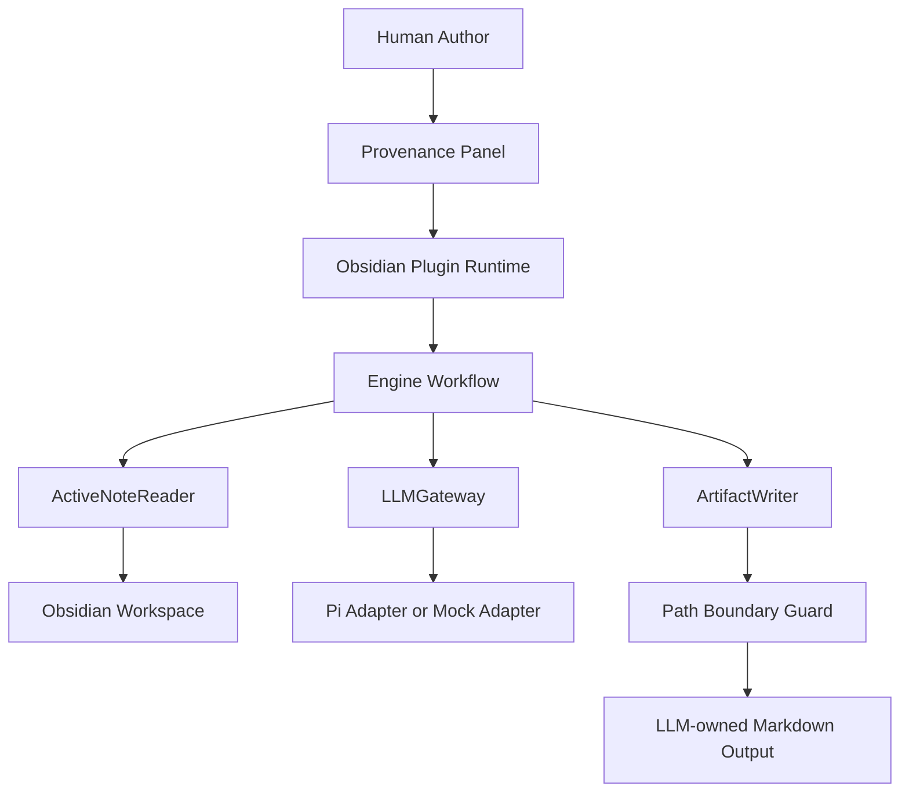
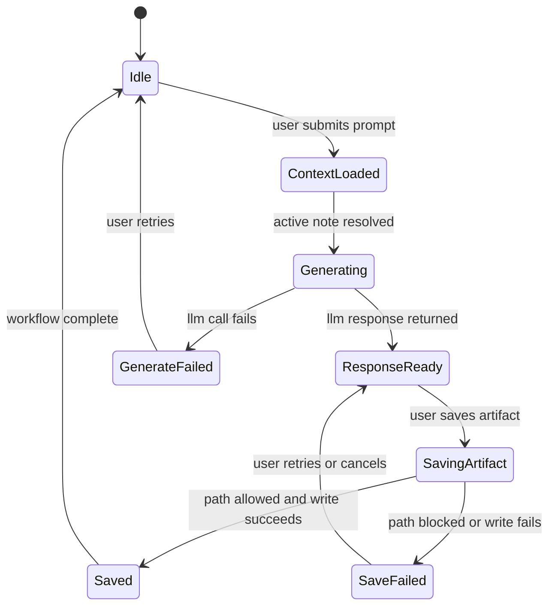
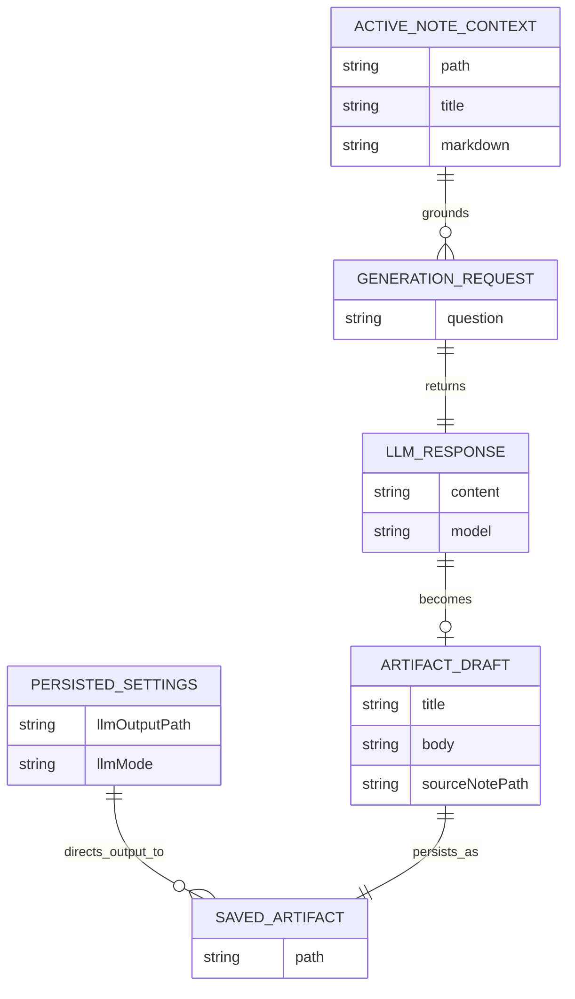
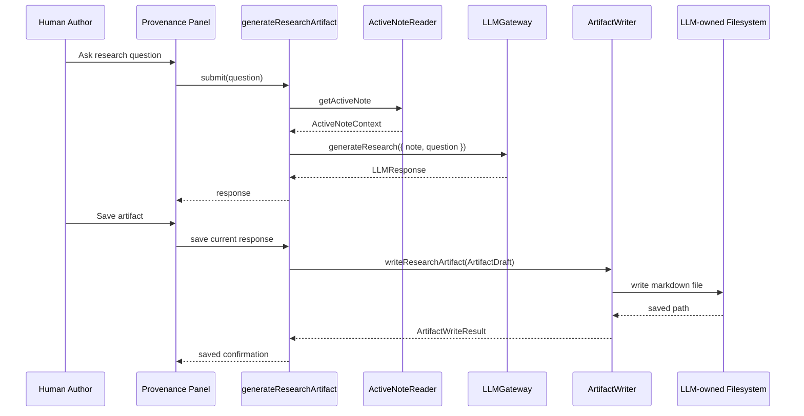

## Architecture Summary

The Plugin MVP uses a three-part architecture that matches the current monorepo:

1. `apps/provenance-obsidian-plugin` owns the Obsidian runtime edge, UI surfaces, persisted settings, and plugin lifecycle.
2. `packages/engine` owns feature workflows and Effect capability contracts such as active-note reading, artifact writing, and LLM generation.
3. `packages/shared` owns small cross-boundary data contracts and path helpers shared between the plugin app and engine.

The design keeps the Obsidian app thin. The plugin runtime assembles adapters for the active Obsidian session, then calls engine workflows through narrow Effect service boundaries. The main user-visible workflow is: read the active note, send note context plus the user's question to an LLM gateway, then optionally persist a generated markdown artifact through a boundary-guarded artifact writer.

Effect-specific decomposition follows the smallest-stable-abstraction rule:

- shared note and artifact shapes remain plain shared contracts until stronger schema needs appear;
- filesystem and LLM access remain `ServiceMap.Service` capabilities because they own IO and runtime substitution;
- the Obsidian plugin remains the runtime edge that assembles the feature runtime;
- no `Atom` is required yet because the MVP has a simple panel and no shared reactive state beyond the active plugin view.

Reactive and background state profile: UI-facing reactive state only, with no long-lived background worker in the MVP.
Persistence contract shape: existing external DTO-style interfaces in `packages/shared`, with `TODO: Confirm` on whether later phases should promote artifact and settings contracts to `Schema.Class` or plain `Schema`.
Runtime profile: browser-like Obsidian plugin runtime with local filesystem access.
Multi-runtime breakdown: single runtime for the MVP, with Pi hidden behind an adapter rather than exposed as a separate runtime surface.

## System Context

The plugin runs inside Obsidian desktop, where it can access the active workspace, plugin settings, and local filesystem integrations available to the plugin environment. The user interacts only with the Provenance panel and the configured output directory. External LLM execution stays behind a gateway boundary, initially expected to be Pi-backed.

- Human Author uses the Provenance panel inside Obsidian.
- Obsidian provides workspace, views, commands, and persisted plugin data.
- The plugin app adapts Obsidian APIs into Effect services.
- The engine orchestrates note-context reads, LLM generation, and artifact persistence.
- The filesystem stores generated markdown artifacts in an LLM-owned output location.
- Pi or a mock mode provides generated responses behind the `LLMGateway` service.

### Context Flowchart

The critical design point is that the panel never writes directly to the vault or to Pi. It hands the request to the engine workflow, and the workflow reaches IO only through explicit services.

## Components and Responsibilities

### Behavior State Diagram

### Obsidian Runtime Edge

- Responsibility: own plugin startup, command registration, panel registration, settings loading, and runtime disposal.
- Inputs: Obsidian `Plugin` lifecycle, workspace events, persisted plugin data.
- Outputs: initialized panel view, runtime wiring, persisted settings updates.

This boundary is currently represented by `apps/provenance-obsidian-plugin/src/main.ts`, `src/commands/openPanel.ts`, and `src/services/runtime.ts`.

### Provenance Panel

- Responsibility: expose the user-facing interaction surface for note-aware chat and future artifact-save actions.
- Inputs: plugin settings, user prompts, workflow results.
- Outputs: displayed chat state, save requests, user-visible status.

The current `PanelView.tsx` is still a placeholder, but it already defines the correct runtime seam: UI inside the app package, behavior delegated downward.

### Engine Workflows

- Responsibility: orchestrate feature behavior from stable capability contracts.
- Inputs: prompt text, active-note context, LLM responses, artifact drafts.
- Outputs: generated responses and saved-artifact results.

The existing `generateResearchArtifact` workflow already demonstrates the intended orchestration order: obtain `ActiveNoteReader`, `LLMGateway`, and `ArtifactWriter`; read the note; request LLM output; persist a research artifact.

### ActiveNoteReader Service

- Responsibility: provide a stable note-context capability to engine workflows.
- Inputs: current Obsidian workspace state.
- Outputs: `path`, `title`, and `markdown` for the active note.

This is correctly modeled as a `ServiceMap.Service` because callers need a stable capability seam while the implementation remains runtime-specific.

### LLMGateway Service

- Responsibility: accept structured generation requests and return structured model output while hiding Pi-specific details.
- Inputs: active note context and optional user question.
- Outputs: generated content and optional model metadata.

This is a capability boundary, not a UI concern. Pi-specific session setup, prompt shaping, and fallback behavior stay inside the adapter implementation.

### ArtifactWriter Service

- Responsibility: persist machine-owned markdown artifacts only after path validation succeeds.
- Inputs: artifact draft and resolved target path.
- Outputs: saved artifact path or a typed write failure.

This service should own filename creation, conflict handling, and filesystem writes. It should not own note reading or LLM interaction.

### Path Boundary Guard

- Responsibility: determine whether a target path is inside the configured LLM-owned output root.
- Inputs: configured base path and candidate output path.
- Outputs: allow or reject decision.

Today, `packages/shared/src/paths.ts` provides `normalizeSlashes` and `isWithinBasePath`. The design keeps that logic as a small contract-level helper until policy needs become richer. If boundary policy grows to include path canonicalization, symlink checks, or scoped filesystem state, promote it into an engine capability service.

### Shared Contracts Module

- Responsibility: define lightweight cross-boundary data shapes used by engine and app packages.
- Inputs: none beyond shared package ownership.
- Outputs: `ArtifactDraft`, `ActiveNoteContext`, `LLMResponse`, and path helper functions.

These are shared DTO-like interfaces today. `TODO: Confirm` whether later phases need schema-backed validation at runtime boundaries.

## Data Model and Data Flow

- Entities:
  - `ActiveNoteContext`: current note `path`, `title`, and `markdown`.
  - `GenerateResearchInput`: note context plus optional question.
  - `LLMResponse`: generated content and optional model identifier.
  - `ArtifactDraft`: title, body, and source note path before persistence.
  - `ArtifactWriteResult`: final saved path after persistence.
  - `PersistedSettings`: output path and LLM mode (`disabled`, `mock`, or `pi`).
- Flow:
  1. The panel gathers a prompt.
  2. The runtime resolves current settings.
  3. The engine reads the active note through `ActiveNoteReader`.
  4. The engine sends structured input to `LLMGateway`.
  5. The UI shows the response.
  6. On save, the engine converts the response into an `ArtifactDraft`.
  7. The writer validates the target path against the configured output root and persists markdown.

### Entity Relationship Diagram

The MVP has a light data model with only one persisted artifact output and one persisted settings object. That simplicity is intentional.

## Interfaces and Contracts

- `ActiveNoteReader`
  - Public contract: `getActiveNote: Effect<ActiveNoteContext>`
  - Hidden details: how Obsidian workspace state is queried and validated.
- `LLMGateway`
  - Public contract: `generateResearch(input: GenerateResearchInput): Effect<LLMResponse>`
  - Hidden details: Pi calls, session handling, prompt templates, provider selection, retries.
- `ArtifactWriter`
  - Public contract: `writeResearchArtifact(draft: ArtifactDraft): Effect<ArtifactWriteResult>`
  - Hidden details: filename derivation, metadata block layout, conflict policy, filesystem operations.
- Shared path helper
  - Public contract: `isWithinBasePath(basePath, candidatePath): boolean`
  - Hidden details: slash normalization strategy only; no broader policy yet.
- Plugin runtime edge
  - Public contract: `makePluginRuntime(options)` returns a disposable runtime handle.
  - Hidden details: service assembly, subscriptions, and future cleanup hooks.

### Interaction Diagram

The interaction contract remains small: the panel talks to a workflow boundary, not directly to individual adapters.

## Integration Points

- Obsidian workspace integration: resolve the active note, open the panel view, register commands, and persist plugin settings.
- Filesystem integration: write generated markdown to the configured output root and reject out-of-bounds writes.
- Pi integration: implement `LLMGateway` in `pi` mode while preserving `mock` mode for deterministic local testing.
- Monorepo package integration: keep shared contracts in `packages/shared`, reusable workflows in `packages/engine`, and runtime-specific adapters in the app package.

## Failure and Recovery Strategy

- Missing active note: fail the workflow with a typed domain error and show a user-facing message that a note must be active before generation runs.
- Invalid output path: block the save request before filesystem mutation and surface the configured path problem clearly.
- Forbidden write target: reject the write when the target escapes the configured output root.
- LLM generation failure: preserve the note context and prompt state so the user can retry without re-entering everything.
- Artifact write failure: keep the generated response in memory so the user can retry save, change configuration, or copy content manually.
- Plugin shutdown: release runtime resources through `makePluginRuntime().dispose()` when subscriptions or watchers are introduced.

Recoverable failures should stay in the typed error channel of engine services rather than surfacing as opaque thrown exceptions.

## Security, Reliability, and Performance

- Security: the main MVP security property is authorship boundary enforcement. The plugin may read human-authored notes for context, but machine-generated output must stay in the configured machine-owned path.
- Reliability: storage configuration should be explicit and persisted so repeated sessions use the same boundary rules.
- Reliability: mock mode should remain available so workflows can be validated without live Pi access.
- Reliability: path checks should happen before writes, and later phases should add canonical path resolution if symlink behavior or relative-path escapes become a practical risk. TODO: Confirm exact canonicalization approach.
- Performance: active-note reads and single-response generation are small operations for the MVP; no background indexing, vector storage, or watch-heavy architecture is needed.
- Performance: the panel should remain responsive by keeping blocking IO and provider calls behind Effect boundaries rather than inline in UI rendering.

## Implementation Strategy

Implement in vertical slices that preserve the current package seams instead of introducing a large rewrite.

1. Complete the Obsidian runtime edge so the panel can submit prompts and receive workflow results.
2. Add an Obsidian-backed `ActiveNoteReader` adapter in the app package.
3. Add an artifact-writing adapter that uses the configured output path and shared path-check helpers.
4. Implement `LLMGateway` adapters for `mock` and `pi` modes behind the same engine contract.
5. Thread settings from `PersistedSettings` into runtime assembly so workflows always receive explicit configuration.
6. Refine the workflow split if needed:
   - one workflow for generate-only chat responses;
   - one workflow for save-artifact actions.

Effect-specific recomposition should happen in one visible runtime seam inside the app package. The Obsidian app should assemble adapter layers and provide them once, rather than letting views or commands `provide` dependencies ad hoc. This follows the effect-technical-design guidance to keep recomposition obvious and centralized.

## Testing Strategy

- Unit tests in `packages/shared` should lock path-boundary behavior, including exact-match and nested-path cases for `isWithinBasePath`.
- Unit tests in `packages/engine` should cover workflow orchestration with substituted `ActiveNoteReader`, `LLMGateway`, and `ArtifactWriter` services.
- Adapter tests in the app package should verify settings loading, runtime assembly, and Obsidian view integration at the seam the app owns.
- Contract tests should verify that `mock` and `pi` gateway adapters satisfy the same engine-facing `LLMGateway` contract.
- Manual validation should exercise at least two output configurations: an in-vault `.provenance/...` path and an external directory.
- Manual validation should also confirm that generated artifacts remain inspectable from the chosen output location and never appear as plugin-authored writes in the human-authored note area.

## Risks and Tradeoffs

- Tradeoff: keeping shared contracts as simple interfaces speeds the MVP, but it defers runtime validation and richer invariants until later.
- Tradeoff: using Pi behind an adapter may reduce custom integration work, but it could still add complexity if the MVP only needs a thin request-response path.
- Risk: Obsidian behavior around hidden folders, external directories, or separate vault views may prove awkward even if the write boundary is technically correct.
- Risk: a single chat panel may not give enough affordance for saving, revisiting, and comparing generated artifacts; the MVP should validate workflow usefulness, not assume it.
- Risk: path-prefix validation alone may be insufficient if symlink resolution or path normalization semantics differ across environments. TODO: Confirm whether canonical path checks are required in the MVP or only in the next phase.
- Tradeoff: keeping recomposition centralized in the app runtime improves clarity, but it means plugin-specific adapters remain outside the engine package even when the service contracts stabilize.

## Further Notes

- Assumptions: The repository's current `packages/engine` services and workflow files are the intended starting point; the current plugin panel is a placeholder rather than the final UX; the MVP remains single-runtime and local-first.
- Open questions: Whether save-artifact should be part of the same workflow that generates a response or a separate workflow; whether artifact files should embed frontmatter metadata or simple markdown headings; whether the app should expose a dedicated artifact browser later.
- TODO: Confirm: Exact error taxonomy for engine services; filename collision policy for repeated saves from the same note; whether shared contracts should stay as plain TypeScript interfaces or gain runtime schemas before the next phase.
